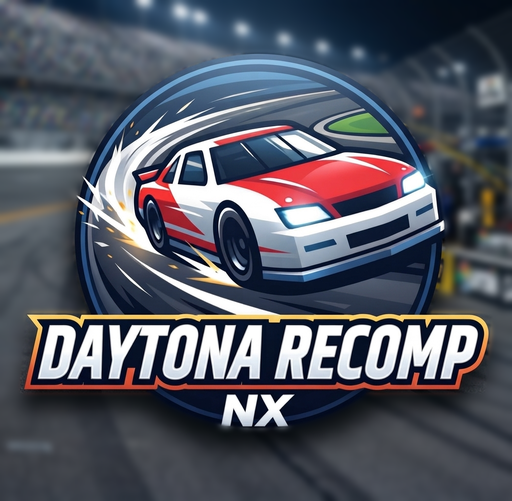

<p align="center">
  
</p>

<h1 align="center">Daytona Recomp NX</h1>

<p align="center">
  A native Nintendo Switch port of the <b>Daytona USA</b> (Sega Model 2) static recompilation.<br>
  No emulator, no interpreter: the arcade game's own code, recompiled to C++ and built as a homebrew <code>.nro</code>.
</p>

---

> [!IMPORTANT]
> **This is an unofficial fan project. It is not affiliated with, endorsed by or sponsored by SEGA.**
> *Daytona USA* and *SEGA* are trademarks of SEGA Corporation. All other trademarks belong to their owners.
>
> **No ROMs, game code or game assets are included in this repository, and none will be provided.**
> You need your own legally obtained Daytona USA arcade ROM set. The game code is generated on your own
> computer from that ROM set when you build, so **do not share the `.nro` you build**: it contains code
> translated from the original game.

## About

This is a fork of [alphanu1/daytona-arcade-recomp](https://github.com/alphanu1/daytona-arcade-recomp), which
statically recompiles Daytona USA's i960 main program, its TGP (geometry) program and the sound board's 68000
program to portable C++, with the Model 2 hardware (geometrizer, rasterizer, tilemaps, sound chips) as native code.

This fork adds a Nintendo Switch target (`platform/switch`, libnx + SDL2) with:

- **Full speed on a real Switch** (the arcade's 57.5 Hz).
- **Multi-core rendering**: the 3D layer, the 2D tile layers and the final composition are drawn on all three
  CPU cores, scanline by scanline, with pixel-identical output to the original renderer.
- **Sound board on its own core**, overlapping the next frame.
- **Boots straight into the game**, as a single cabinet (the 1994 set's factory setting is a linked twin cabinet).
- Switch controls, an in-game menu, saves on the SD card and a Homebrew Menu icon.

## Supported ROM sets

| Set | Game | Notes |
| --- | --- | --- |
| `daytona` | Daytona USA, Revision A (1994) | Recommended. Complete as a MAME set. |
| `daytona93` | Daytona USA Deluxe '93 | Must be a **non-merged** set. MAME's split `daytona93.zip` is missing the files it shares with `daytona` (e.g. `mpr-16528.10`). |

Other sets (`daytonas`, `daytonat`, `daytonase`, …) have different program ROMs and **cannot** be used, whatever
the file is called. The ROM set must be a `.zip` (not `.7z`) on the Switch.

## Building

Builds run on **Linux** or **Windows with WSL** (Ubuntu). Two steps: a normal PC build, which recompiles the game
from your ROM set, then a cross-build for the Switch.

### 1. Requirements

Host tools and the libraries the PC build needs (Ubuntu / Debian):

```sh
sudo apt-get update
sudo apt-get install -y build-essential cmake ninja-build python3 git clang pkg-config unzip zip \
  libasound2-dev libpulse-dev libx11-dev libxext-dev libxrandr-dev libxcursor-dev \
  libxfixes-dev libxi-dev libxss-dev libxtst-dev libxkbcommon-dev libdrm-dev libgbm-dev \
  libegl-dev libwayland-dev libdecor-0-dev libudev-dev libdbus-1-dev
```

[devkitPro](https://devkitpro.org/wiki/Getting_Started) with the Switch packages:

```sh
sudo dkp-pacman -S switch-dev switch-sdl2
export DEVKITPRO=/opt/devkitpro
```

### 2. Get the source and your ROM set

```sh
git clone https://github.com/toniisound/daytona-recomp-nx
cd daytona-recomp-nx
mkdir -p roms
cp /path/to/your/daytona.zip roms/
```

The file name must be exactly the set name: `roms/daytona.zip` or `roms/daytona93.zip`.

### 3. Recompile the game on your PC

```sh
python3 scripts/setup.py
```

This fetches the pinned libraries into `extern/`, checks your ROM set, recompiles the game code into
`build-daytona/gen/` (or `build/gen/` for `daytona93`) and builds the PC version. If the ROM set is rejected,
the line starting with `m2import:` names the first missing or wrong file.

> Generated code and everything under `build*/` is derived from your ROM set. It is git-ignored: never commit or
> share it.

### 4. Build the Switch `.nro`

```sh
python3 scripts/build_switch.py --set daytona      # or --set daytona93
```

Output: `build/switch-daytona/daytona_switch.nro` (`build/switch/` for `daytona93`).

Options:

| Option | Effect |
| --- | --- |
| `--set daytona` / `daytona93` | The ROM set you recompiled in step 3. |
| `--icon file.jpg` | Another 256×256 JPEG for the Homebrew Menu (default: `platform/switch/icon.jpg`). |
| `--diagnostics` | Log startup and performance to the SD card (errors are always logged). |
| `--compile-check` | Build everything except the game code, without a ROM set. |
| `--jobs N` | Parallel compile jobs. |

## Installing

Copy the `.nro` and your ROM set to the same folder on the SD card, named after the set:

```
sdmc:/switch/daytona/daytona_switch.nro
sdmc:/switch/daytona/daytona.zip
```

(For `daytona93`: `sdmc:/switch/daytona93/` with `daytona93.zip`.)

Launch it from the Homebrew Menu **with title override** (hold **R** while starting any game). Applet / album
mode has less memory; the menu warns you if you are in it.

The game starts straight away. Settings and saves are kept in the same folder:

| File | Contents |
| --- | --- |
| `ioboard_eeprom.bin` | The game's own settings (test mode: cabinet, link, coins, difficulty…) |
| `backup_ram.bin` | Records and bookkeeping |
| `mute.bin`, `overlay.bin` | Menu settings |
| `switch-diag.log` | Errors, if any |

## Controls

| Arcade | Switch |
| --- | --- |
| Steering | Left stick, or D-pad left / right |
| Accelerator / brake | ZR / ZL, or right stick up / down (analogue) |
| Shift up / down | R / L, or D-pad up / down |
| View buttons (VR1–VR4) | A / B / Y / X |
| Coin | − |
| Start | + |
| Test / service switches | L3 / R3 (stick clicks) |
| **Menu** | **+ and − together** |

**Menu:** resume, reset, test and service switches, sound on/off, CPU cores (3 or 1, to compare), performance bar
(frame rate and timings at the bottom of the screen), save and quit.

**Test mode:** press L3. R3 moves the cursor, L3 selects. Settings are saved automatically.

## Troubleshooting

| Problem | Fix |
| --- | --- |
| `m2import: missing mpr-16528.10` (or another `mpr-` file) | Your `daytona93.zip` is a split set. Use `daytona.zip`, or merge the parent `daytona.zip` into it. |
| `m2import: missing epr-…` | Wrong set for that name (see *Supported ROM sets*). |
| `ROM NOT FOUND` in the menu | The ROM set is not next to the `.nro`, or not named after the set. |
| The game waits for a second cabinet | An old `ioboard_eeprom.bin` set to a linked cabinet: delete it, or in test mode set *GAME SYSTEM → LINK ID → SINGLE*. |
| Buttons do nothing in Ryujinx | Check the emulator's input mapping for Player 1, including +, −, ZL/ZR and the stick clicks. |
| Slow in Ryujinx | Expected on some PCs; test on real hardware. |

## Credits

- **[alphanu1](https://github.com/alphanu1)**: the Daytona USA static recompilation this port is built on.
- **Toniisound**: Nintendo Switch port.
- **MAME** team: Model 2 hardware code the runtime is based on (BSD-3-Clause).
- **ymfm** (Aaron Giles), **Berkeley SoftFloat 3**, **SDL**, **devkitPro / libnx**.

Every third-party component, its licence and how it is used is listed in [THIRD_PARTY.md](THIRD_PARTY.md).
The original project's README, with the PC and PS Vita instructions, is in
[docs/README-upstream.md](docs/README-upstream.md).
